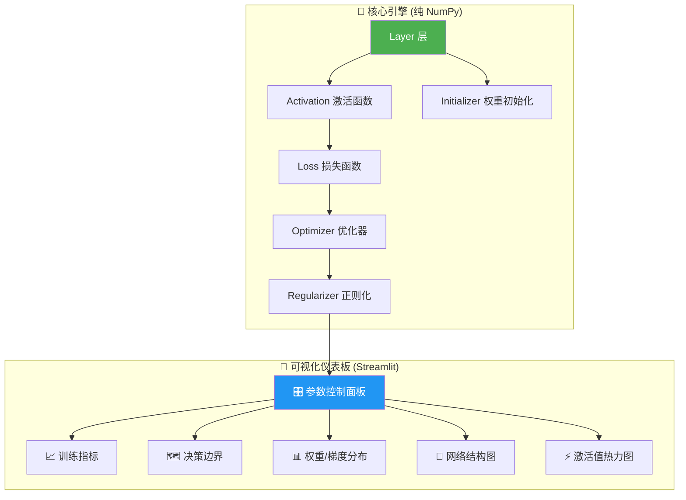

# 🧠 手搓神经网络 · 可视化实验平台

从零用 **纯 NumPy** 手写一个完整的神经网络框架，并搭配 **Streamlit 交互式可视化仪表板**，让你通过拖动滑块、实时观察每个参数对训练结果的影响，从而深入理解深度学习的底层原理。

---

## 核心理念

> **"不用任何深度学习框架，一行一行手搓前向传播、反向传播、优化器"**
>
> 同时用可视化仪表板将「黑箱」变成「透明箱」——每一个权重、每一个梯度、每一条决策边界，都看得清清楚楚。

---

## User Review Required

> [!IMPORTANT]
> **技术栈确认**：本计划使用 **Python + NumPy（手写核心）** + **Streamlit（可视化交互）** + **Plotly（图表）**。不依赖 PyTorch / TensorFlow，所有前向/反向传播均手写实现。请确认你对此技术栈没有异议。

> [!IMPORTANT]
> **学习路径选择**：本计划按「渐进式」设计，共 **4 个里程碑**，每个里程碑可独立运行和验证。你可以按需调整学习节奏。

---

## Open Questions

1. **数据集偏好**：默认使用 sklearn 生成的 2D 合成数据集（moons / circles / blobs / XOR），方便在二维平面上可视化决策边界。是否需要额外支持加载自定义 CSV 数据集？
2. **部署环境**：Streamlit 仪表板默认在本地 `localhost:8501` 运行。是否需要考虑远程部署（如 Docker 化或 Streamlit Cloud）？
3. **学习起点**：你目前对线性代数（矩阵乘法）和微积分（链式法则）的熟悉程度如何？这将影响代码注释的详细程度。

---

## 总体架构



---

## 项目目录结构

```
c:\repo\LLM_test\
├── README.md                          # 项目说明文档
├── LICENSE                            # MIT License
├── pyproject.toml                     # 项目配置 & 依赖管理 (uv)
├── .gitignore                         # Git 忽略规则
│
├── nn_core/                           # 🔧 核心引擎 (纯 NumPy 手写)
│   ├── __init__.py
│   ├── tensor.py                      # 基础张量操作与数值稳定性工具
│   ├── layers.py                      # Dense 全连接层、Dropout 层
│   ├── activations.py                 # Sigmoid, ReLU, Tanh, Softmax, LeakyReLU
│   ├── losses.py                      # MSE, CrossEntropy, BinaryCrossEntropy
│   ├── optimizers.py                  # SGD, Momentum, RMSProp, Adam
│   ├── initializers.py                # Zero, Random, Xavier, He 初始化
│   ├── regularizers.py                # L1, L2, Dropout 正则化
│   ├── model.py                       # Sequential 模型容器 (组装层)
│   └── callbacks.py                   # 训练历史记录、早停回调
│
├── datasets/                          # 📦 数据集工具
│   ├── __init__.py
│   └── generators.py                  # 2D 合成数据集生成 (moons, circles, XOR, spiral)
│
├── dashboard/                         # 🎨 Streamlit 可视化仪表板
│   ├── __init__.py
│   ├── app.py                         # Streamlit 主入口
│   ├── pages/
│   │   ├── 1_🎯_单神经元感知器.py      # 里程碑 1: 单神经元学习
│   │   ├── 2_🧱_多层网络.py           # 里程碑 2: 多层网络
│   │   ├── 3_⚙️_优化器对比.py          # 里程碑 3: 优化器效果对比
│   │   └── 4_🔬_参数实验室.py          # 里程碑 4: 全参数交互实验
│   ├── components/
│   │   ├── param_panel.py             # 参数控制面板组件
│   │   ├── charts.py                  # Plotly 图表封装
│   │   └── network_viz.py             # 网络结构可视化组件
│   └── utils/
│       └── state.py                   # Streamlit Session State 管理
│
├── tests/                             # ✅ 单元测试
│   ├── __init__.py
│   ├── test_layers.py
│   ├── test_activations.py
│   ├── test_losses.py
│   ├── test_optimizers.py
│   └── test_gradients.py             # 梯度数值校验 (Gradient Checking)
│
├── notebooks/                         # 📓 Jupyter 学习笔记
│   └── 00_math_foundations.ipynb      # 数学基础推导
│
├── scripts/                           # 🚀 CI/CD 与自动化
│   ├── run_dashboard.ps1              # PowerShell 启动脚本
│   └── run_tests.ps1                  # 测试执行脚本
│
└── logs/                              # 📋 训练日志输出
    └── .gitkeep
```

---

## Proposed Changes

### 里程碑 1：单神经元感知器 · 理解最小计算单元

> **目标**：手写一个单层感知器，理解 **前向传播、损失计算、反向传播、梯度下降** 的完整闭环。

#### [NEW] [tensor.py](file:///c:/repo/LLM_test/nn_core/tensor.py)
- 数值稳定性工具函数：`clip_gradients()`, `safe_log()`, `safe_exp()`
- 随机种子管理，确保实验可复现

#### [NEW] [layers.py](file:///c:/repo/LLM_test/nn_core/layers.py)
- `Dense` 类：全连接层
  - `forward(X)` → 前向传播：$Z = XW + b$
  - `backward(dZ)` → 反向传播：计算 $\frac{\partial L}{\partial W}$, $\frac{\partial L}{\partial b}$, $\frac{\partial L}{\partial X}$
  - 内部缓存输入 $X$ 用于反向传播

#### [NEW] [activations.py](file:///c:/repo/LLM_test/nn_core/activations.py)
- 每个激活函数实现 `forward()` 和 `backward()` 方法：
  - **Sigmoid**: $\sigma(x) = \frac{1}{1+e^{-x}}$，导数 $\sigma'(x) = \sigma(x)(1-\sigma(x))$
  - **ReLU**: $f(x) = \max(0, x)$，导数为阶跃函数
  - **Tanh**: $\tanh(x)$，导数 $1 - \tanh^2(x)$
  - **Softmax**: 多分类场景
  - **LeakyReLU**: 解决 ReLU 的 "dying neuron" 问题

#### [NEW] [losses.py](file:///c:/repo/LLM_test/nn_core/losses.py)
- `MSE`（均方误差）：回归场景基线
- `BinaryCrossEntropy`：二分类
- `CategoricalCrossEntropy`：多分类
- 每个损失函数实现 `forward()` (计算损失值) 和 `backward()` (计算梯度)

#### [NEW] [1_🎯_单神经元感知器.py](file:///c:/repo/LLM_test/dashboard/pages/1_🎯_单神经元感知器.py)
可视化内容：
| 可视化项 | 观察目的 |
|---------|---------|
| **决策边界实时动画** | 看单神经元如何在 2D 平面上画出一条分割线 |
| **损失曲线** | 观察 loss 随 epoch 下降的过程 |
| **权重变化轨迹** | 看 $W_1$, $W_2$, $b$ 如何在参数空间中移动 |
| **学习率滑块** | 拖动观察：太大→震荡，太小→收敛慢 |
| **激活函数切换** | 切换 Sigmoid/ReLU/Tanh 观察决策边界形状变化 |

---

### 里程碑 2：多层网络 · 理解深度的力量

> **目标**：组装多层网络，理解 **链式法则、梯度消失/爆炸、权重初始化** 的影响。

#### [NEW] [model.py](file:///c:/repo/LLM_test/nn_core/model.py)
- `Sequential` 类：按顺序堆叠 Layer + Activation
  - `add(layer)` → 添加层
  - `forward(X)` → 逐层前向传播，**缓存每一层的中间结果**
  - `backward(dLoss)` → 逆序逐层反向传播
  - `get_snapshot()` → 返回所有权重、梯度、激活值的快照（供可视化使用）

#### [NEW] [initializers.py](file:///c:/repo/LLM_test/nn_core/initializers.py)
- **Zero 初始化**：所有权重为 0（故意制造对称性问题，让学习者观察失败）
- **Random 初始化**：小随机数（可调标准差）
- **Xavier (Glorot) 初始化**：$\text{Var}(W) = \frac{2}{n_{in} + n_{out}}$
- **He 初始化**：$\text{Var}(W) = \frac{2}{n_{in}}$（配合 ReLU）

#### [NEW] [2_🧱_多层网络.py](file:///c:/repo/LLM_test/dashboard/pages/2_🧱_多层网络.py)
可视化内容：
| 可视化项 | 观察目的 |
|---------|---------|
| **网络结构拓扑图** | 动态渲染 N 层 × M 神经元的连接图，线条粗细 = 权重大小 |
| **逐层激活值热力图** | 观察每层输出的分布，发现梯度消失（全趋近 0）或爆炸 |
| **权重直方图 (per-layer)** | 对比不同初始化策略下权重分布的演变 |
| **层数/神经元数滑块** | 拖动改变网络结构，观察容量对拟合能力的影响 |
| **初始化方式切换** | Zero vs Random vs Xavier vs He 直观对比 |

---

### 里程碑 3：优化器 · 理解训练动力学

> **目标**：实现 4 种主流优化器，理解 **动量、自适应学习率、一阶/二阶矩估计** 的工作机制。

#### [NEW] [optimizers.py](file:///c:/repo/LLM_test/nn_core/optimizers.py)
- **SGD**：最朴素的随机梯度下降 $W \leftarrow W - \alpha \cdot \nabla W$
- **Momentum**：引入动量项 $v_t = \beta v_{t-1} + \alpha \nabla W$，加速收敛
- **RMSProp**：自适应学习率，用梯度平方的指数移动平均归一化
- **Adam**：结合 Momentum + RMSProp + 偏差修正，当前最主流

#### [NEW] [regularizers.py](file:///c:/repo/LLM_test/nn_core/regularizers.py)
- **L1 正则化**：$\lambda \sum |W|$（产生稀疏解）
- **L2 正则化**：$\lambda \sum W^2$（权重衰减，防止过大值）
- **Dropout**：训练时随机关闭神经元（在 `layers.py` 中实现 `Dropout` 层）

#### [NEW] [3_⚙️_优化器对比.py](file:///c:/repo/LLM_test/dashboard/pages/3_⚙️_优化器对比.py)
可视化内容：
| 可视化项 | 观察目的 |
|---------|---------|
| **多优化器 Loss 对比曲线** | 同一网络结构，SGD vs Momentum vs Adam 的收敛速度对比 |
| **参数空间等高线 + 优化轨迹** | 在 2D 损失曲面上画出每个优化器的「下山路径」 |
| **学习率 vs 最终 Loss 扫描** | 扫描不同学习率，找到甜蜜点 |
| **正则化强度滑块** | 观察 L1/L2 正则化如何抑制过拟合 |
| **Dropout 比例滑块** | 可视化 Dropout 对决策边界平滑度的影响 |

---

### 里程碑 4：参数实验室 · 全维度交互实验

> **目标**：将所有参数整合到一个交互式实验台，支持 **A/B 对比、参数扫描、实验记录**。

#### [NEW] [callbacks.py](file:///c:/repo/LLM_test/nn_core/callbacks.py)
- `TrainingHistory`：记录每个 epoch 的 loss、accuracy、权重快照、梯度统计
- `EarlyStopping`：当 loss 不再下降时自动停止训练
- `ExperimentLogger`：将实验参数 + 结果序列化为 JSON，方便回溯

#### [NEW] [4_🔬_参数实验室.py](file:///c:/repo/LLM_test/dashboard/pages/4_🔬_参数实验室.py)
**全参数控制面板**：

```
┌─────────────────────────────────────────────────────┐
│  📊 数据集    │ moons / circles / XOR / spiral       │
│  🧱 层数      │ ━━━━━━━━━━━━━━━━━━━ [1-8]            │
│  🔢 神经元    │ ━━━━━━━━━━━━━━━━━━━ [1-128]           │
│  ⚡ 激活函数  │ Sigmoid / ReLU / Tanh / LeakyReLU    │
│  📉 损失函数  │ MSE / CrossEntropy                    │
│  🔧 优化器    │ SGD / Momentum / RMSProp / Adam       │
│  📐 学习率    │ ━━━━━━━━━━━━━━━━━━━ [0.0001-1.0]     │
│  📏 Batch大小 │ ━━━━━━━━━━━━━━━━━━━ [4-256]           │
│  🛡️ 正则化    │ None / L1 / L2 / Dropout              │
│  🎲 权重初始化│ Zero / Random / Xavier / He            │
│  📦 Epochs    │ ━━━━━━━━━━━━━━━━━━━ [10-2000]        │
└─────────────────────────────────────────────────────┘
```

**可视化面板 (4宫格布局)**：

| 左上 | 右上 |
|------|------|
| 📈 **训练曲线** (Loss + Accuracy) | 🗺️ **决策边界** (实时渲染) |
| **左下** | **右下** |
| 📊 **权重/梯度直方图** (按层分组) | ⚡ **激活值热力图** (按层分组) |

**特色功能**：
- 🔀 **A/B 对比模式**：同时运行两组不同参数，左右分屏对比
- 📷 **快照对比**：保存某个参数配置的结果，与当前结果叠加对比
- 🔄 **逐步训练**：点击 "Step" 按钮逐个 epoch 执行，观察每一步的变化
- 📋 **实验日志**：自动记录每次实验的参数配置和最终指标

---

### 基础设施 & DevOps

#### [NEW] [pyproject.toml](file:///c:/repo/LLM_test/pyproject.toml)
```toml
[project]
name = "nn-playground"
version = "0.1.0"
requires-python = ">=3.11"
dependencies = [
    "numpy>=1.26",
    "streamlit>=1.38",
    "plotly>=5.22",
    "scikit-learn>=1.5",  # 仅用于生成合成数据集
    "pytest>=8.0",
]
```

#### [NEW] [.gitignore](file:///c:/repo/LLM_test/.gitignore)
#### [NEW] [LICENSE](file:///c:/repo/LLM_test/LICENSE) — MIT License, Copyright (c) 2026 Yy1 (yuan278501381)
#### [NEW] [README.md](file:///c:/repo/LLM_test/README.md)

#### [NEW] [run_dashboard.ps1](file:///c:/repo/LLM_test/scripts/run_dashboard.ps1)
```powershell
# 一键启动可视化仪表板
uv run streamlit run dashboard/app.py --server.port 8501
```

#### [NEW] [run_tests.ps1](file:///c:/repo/LLM_test/scripts/run_tests.ps1)
```powershell
# 运行所有测试（含梯度数值校验）
uv run pytest tests/ -v --tb=short
```

---

### 测试 & 梯度校验

#### [NEW] [test_gradients.py](file:///c:/repo/LLM_test/tests/test_gradients.py)
- **数值梯度校验 (Gradient Checking)**：最关键的验证手段
  - 对每个参数 $\theta$ 计算数值梯度：$\frac{L(\theta + \epsilon) - L(\theta - \epsilon)}{2\epsilon}$
  - 与反向传播计算的解析梯度对比，相对误差 < $10^{-7}$ 即通过
  - 覆盖所有层类型 × 所有激活函数的组合

#### [NEW] 其他测试文件
- `test_layers.py`：Dense 层前向/反向结果正确性
- `test_activations.py`：各激活函数的输出和导数
- `test_losses.py`：各损失函数的计算和梯度
- `test_optimizers.py`：各优化器一步更新后参数变化方向正确

---

## 可视化效果清单

下表汇总了整个项目中所有可观察的维度，以及它们帮助你理解的核心概念：

| 可视化维度 | 可调参数 | 你将学到什么 |
|-----------|---------|-------------|
| 🗺️ 决策边界 | 层数、神经元数、激活函数 | 网络容量如何影响拟合复杂边界的能力 |
| 📈 Loss 曲线 | 学习率、优化器、Batch | 不同超参对收敛速度和稳定性的影响 |
| 📊 权重直方图 | 初始化方式、正则化 | 初始化如何影响训练起点，正则化如何约束权重范围 |
| 🔥 梯度直方图 | 层数、激活函数 | 梯度消失/爆炸现象的直观表现 |
| ⚡ 激活值热力图 | 激活函数、层深度 | 不同激活函数如何变换数据的分布 |
| 🛤️ 优化轨迹 | 优化器类型、学习率 | 动量和自适应学习率如何改变优化路径 |
| 🧬 网络结构图 | 层数、神经元数 | 直观理解网络拓扑和参数规模 |

---

## 开发顺序 & 时间估计

| 阶段 | 内容 | 建议学习时间 |
|-----|------|-------------|
| **M1** | 单神经元 + 基础可视化 | 2-3 天 |
| **M2** | 多层网络 + 权重/梯度可视化 | 3-4 天 |
| **M3** | 优化器 + 正则化 + 对比可视化 | 3-4 天 |
| **M4** | 参数实验室 + A/B 对比 + 实验日志 | 2-3 天 |
| **测试** | 梯度校验 + 单元测试 | 贯穿全程 |

---

## Verification Plan

### Automated Tests
```powershell
# 运行全部单元测试 + 梯度校验
uv run pytest tests/ -v --tb=short

# 单独运行梯度校验（最关键）
uv run pytest tests/test_gradients.py -v
```

### Manual Verification
1. **梯度正确性**：数值梯度 vs 解析梯度的相对误差 < $10^{-7}$
2. **可视化验证**：启动 Streamlit 仪表板，手动拖动每个参数滑块，确认图表实时响应
3. **已知模式验证**：
   - 单神经元 + Sigmoid 应该能正确分类线性可分数据
   - 多层网络应该能拟合 XOR / moons 等非线性数据
   - Zero 初始化应该导致训练失败（权重不更新）
   - Adam 收敛速度应该明显快于 vanilla SGD
4. **跨分辨率测试**：在不同 DPI 缩放下确认 Streamlit 布局正常
